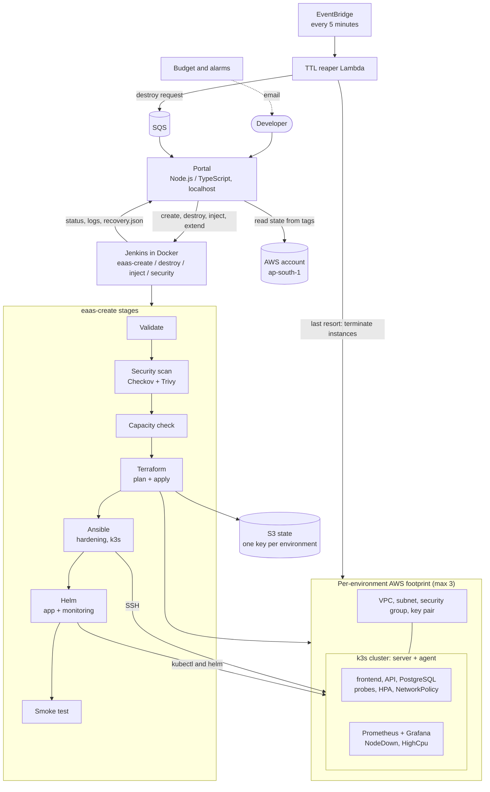
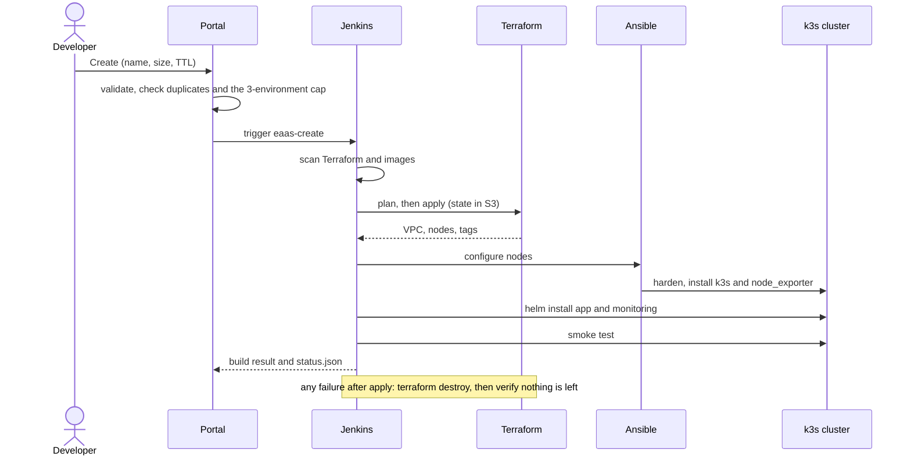
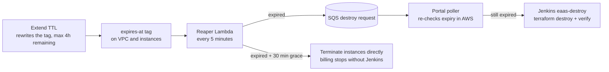

# Architecture diagrams

## System overview

```mermaid
flowchart TB
    dev([Developer]) --> portal["Portal<br/>Node.js / TypeScript, localhost"]
    portal -->|"create, destroy, inject, extend"| jenkins["Jenkins in Docker<br/>eaas-create / destroy / inject / security"]
    jenkins -->|"status, logs, recovery.json"| portal
    portal -->|"read state from tags"| aws[("AWS account<br/>ap-south-1")]

    subgraph pipeline["eaas-create stages"]
        v["Validate"] --> sec["Security scan<br/>Checkov + Trivy"] --> cap["Capacity check"] --> tf["Terraform<br/>plan + apply"] --> ans["Ansible<br/>hardening, k3s"] --> helm["Helm<br/>app + monitoring"] --> smoke["Smoke test"]
    end
    jenkins --> pipeline

    tf --> state[("S3 state<br/>one key per environment")]
    tf --> env

    subgraph env["Per-environment AWS footprint (max 3)"]
        net["VPC, subnet, security group, key pair"]
        subgraph k3s["k3s cluster: server + agent"]
            app["frontend, API, PostgreSQL<br/>probes, HPA, NetworkPolicy"]
            mon["Prometheus + Grafana<br/>NodeDown, HighCpu"]
        end
        net --- k3s
    end

    ans -->|"SSH"| k3s
    helm -->|"kubectl and helm"| k3s

    eb["EventBridge<br/>every 5 minutes"] --> lambda["TTL reaper Lambda"]
    lambda -->|"destroy request"| sqs[("SQS")]
    sqs --> portal
    lambda -->|"last resort: terminate instances"| env
    budget["Budget and alarms"] -.->|"email"| dev
```

## Creating an environment

```mermaid
sequenceDiagram
    actor U as Developer
    participant P as Portal
    participant J as Jenkins
    participant T as Terraform
    participant A as Ansible
    participant K as k3s cluster
    U->>P: Create (name, size, TTL)
    P->>P: validate, check duplicates and the 3-environment cap
    P->>J: trigger eaas-create
    J->>J: scan Terraform and images
    J->>T: plan, then apply (state in S3)
    T-->>J: VPC, nodes, tags
    J->>A: configure nodes
    A->>K: harden, install k3s and node_exporter
    J->>K: helm install app and monitoring
    J->>K: smoke test
    J-->>P: build result and status.json
    Note over J,T: any failure after apply: terraform destroy, then verify nothing is left
```

## Expiry and recovery

```mermaid
flowchart LR
    tag["expires-at tag<br/>on VPC and instances"] --> reaper["Reaper Lambda<br/>every 5 minutes"]
    reaper -->|"expired"| q[("SQS destroy request")]
    q --> poll["Portal poller<br/>re-checks expiry in AWS"]
    poll -->|"still expired"| destroy["Jenkins eaas-destroy<br/>terraform destroy + verify"]
    reaper -->|"expired + 30 min grace"| kill["Terminate instances directly<br/>billing stops without Jenkins"]
    extend["Extend TTL<br/>rewrites the tag, max 4h remaining"] --> tag
```
